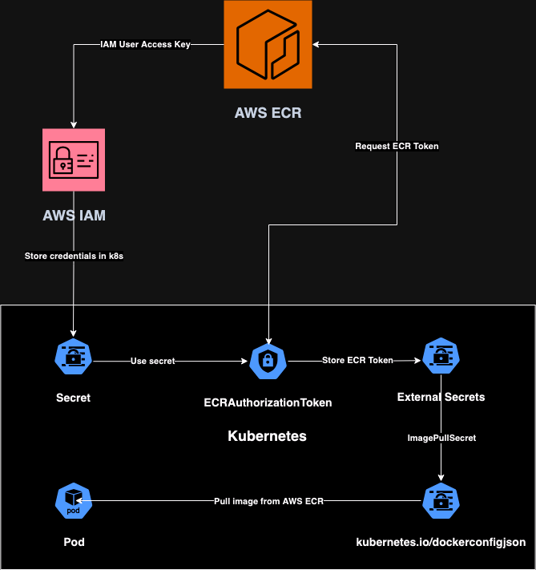

# secrext-helm-chart
  

## Description
Secrext is a custom helm chart to handle Kubernetes External Secret Operator which allow you to renew AWS Elastic Container Registry (ECR) Authorization token automatically

## Pre-requisites
* [External Secret Operator](https://external-secrets.io) installed in your Kubernetes cluster
* AWS credentials with permissions to work with ECR

## How do I get set up?
1. Clone this repository to your local
```bash
git clone https://github.com/Eliezergh/secrext-helm-chart.git
```
2. Ensure to satisfy the requirements
3. Setup the values.yaml file with your own values
4. Run the following command to install the chart
```bash
helm install secrext ./secrext
```
5. If you want to pass the values as arguments, you can run the following command

    5.1 Export the values as environment variables
    ```bash
    export AWS_ACCESS_KEY_ID=<your-access-key-id>
    export AWS_SECRET_ACCESS_KEY=<your-secret-access-key>
    export AWS_DEFAULT_REGION=<your-region>
    export SECRET_NAME=<your-secret-name>
    ```
    5.2 Run the following command to install the chart
    ```bash
    helm install secrext ./secrext \
     --set secret.aws_access_key_id=$AWS_ACCESS_KEY_ID \
     --set secret.aws_secret_access_key=$AWS_SECRET_ACCESS_KEY \
     --set ECRAuthorizationToken.region=$AWS_DEFAULT_REGION \
     --set externalSecret.target.name="$SECRET_NAME"
    ```
## Workflow diagram

## Credits
* [@retributter](https://github.com/retributter) for the original idea, inspiration and individual implementation design
* [@Eliezergh](https://github.com/eliezergh) for the helm chart development
